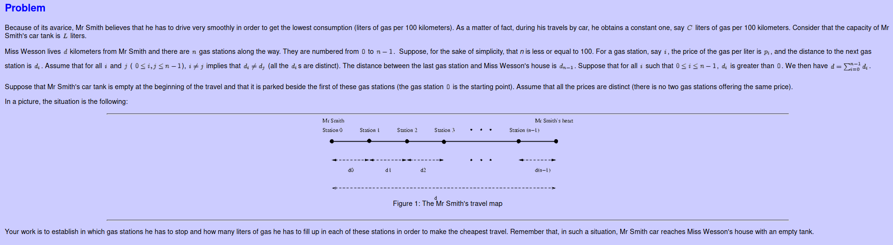

# Gas Crisis

  
  
Mr Smith is in love and he plans to visit the owner of his heart, Miss Wesson. But he is also avaricious, gas is expensive and the travel has to be as cheap as possible, because, as he says to his friend Mr Beretta, "money is for bread and roses, not for gas ". Thus he has to plan very carefully in which gas stations he has to stop. Your goal is to help him to find the cheapest route.  

## Input

  

-   The first line of input contains a float denoting the consumption of the Smith's car (the value of _C_);
-   the second line of input contains an integer denoting the capacity of the car tank (the value of _L_);
-   the third line of input contains an integer denoting the number of gas stations (the value of _n_);
-   the next _n_ lines contain an integer and a float separated by a space. The _i__th_ line of these _n_ lines contains the information of the gas station (_i_-1), thus the first number represents the distance _d__i_-1 and the second represents _p__i_-1.

## Output

There are two kinds of output:

-   The first one is the output produced if there is no possible plan. In this case the output is a single line containing the word NO.  
      
    
-   In case of success, Mr Smith is able to draw a plan to visit Miss Wesson, and the output is organized as follow:  
      
    If Mr. Smith has to stop into _m_ gas stations, your program has to produce _m_ lines of output. Each of these lines is of the form:  
      
    i l
      
    where _i_ is an integer identifying a gas station (its number) and _l_ is the float denoting the quantity (in liters) of gas that Mr Smith took from this gas station. The numbers _i_ and _l_ are separated by a single space. Note that all the produced floating point numbers **must have exactly** two decimal digits.  
      
    These lines are ordered increasingly by the identification of the gas station.

  

## First Sample Input  

7.8  
30  
5  
170 0.49  
100 0.42  
150 0.52  
120 0.53  
50 0.57  

## First Sample Output  

0 13.26  
1 30.00  
2 2.76

## Second Sample Input  

8.8  
30  
3  
250 0.50  
350 0.55  
220 0.45  

## Second Sample Output  

NO
